# Devops-Tooling-Website-Solution
This repostory explains the steps involved in building and deploying a 3-Tier Web application with a single Database and an NFS server as a shared file storage.

----------
__________
### STEP 1 - PREPARE NFS SERVER
* Spin up a new EC2 instance with RHEL Linux 8 Operating System. Name it `nfs server`

* Based on your LVM experience from Project 6, Configure LVM on the Server.

* Instead of formatting the disks as ext4, you will have to format them as xfs.

* Ensure there are 3 Logical Volumes. lv-opt lv-apps, and lv-logs.

* Create 3 volumes in the same AZ as your Web Server EC2, each of 10 GiB.

    1.  On the left hand side of the aws console, under Elastic Blob Store, Click on `Volume`.

    2.  Click create volume

    3.  Choose a small size of 10GB

    4. change the availability zone to eu-west-2b 
    
    5.  Leave other settings default and click `Create volume`

    6.  Next, select the volume created, right click and click `Attach volume`.

    7.  Select the web server instance created. I named my server `web server`. The device name will be `/dev/sdf` but newer Linux kernels may rename your devices to `/dev/xvdf` through /dev/xvdp internally, even when the device name entered is `/dev/sdf`
    
    8.  Click Attach volume 

    

    9.  Repeat steps `2` to `8` for two more volumes so that we can have 3 volumes.

    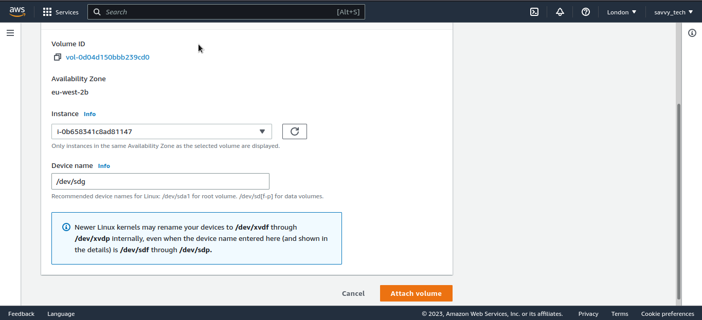

    

* Create mount points on /mnt directory for the logical volumes as follow.
* On your local computer, open the terminal and change directory to the Downloads folder, type

    `cd ~/Downloads`

* Change permissions for the private key file (.pem), otherwise you will get an error “Bad permission”

    `sudo chmod 0400 . pem`

* Connect to the instance by running

   `ssh -i web-server.pem ec2-user@<public ip address>`

   

    Note: For Red hat, the usernanme is ec2-user while for Ubuntu the username is ubuntu.

 * check the volumes created by typing `lsblk`. You will see that the 3 volumes are "xvdf" "xvdg" and "xvdh" of size 10GB each respectively as shown below.

    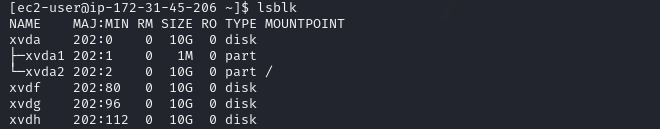

 * Use `df -h` command to see all mounts and free space on your server. `df` means disk free and the flag `-h` displays the output in a human readable format.

    

* Use `gdisk` utility to create a single partition on each of the 3 disks. First start with disk xvdf.

    `sudo gdisk /dev/xvdf`

    * Type p to view the partion table. 

    * Type n to add a new partition. Press enter repeatedly to use the default values

    * Type w to write partition changes to disk. T ype Y on prompt

    

    * Repeat the process for the remaining two disks

    

    

* Use `lsblk` utility to view the newly configured partition on each of the 3 disks.

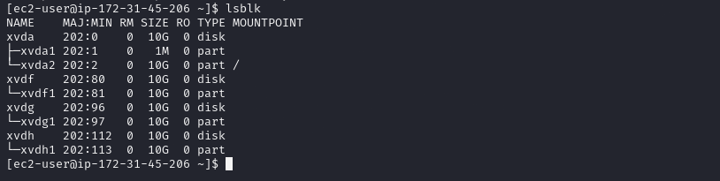

* Install `lvm2` package using `sudo yum install -y lvm2 `

 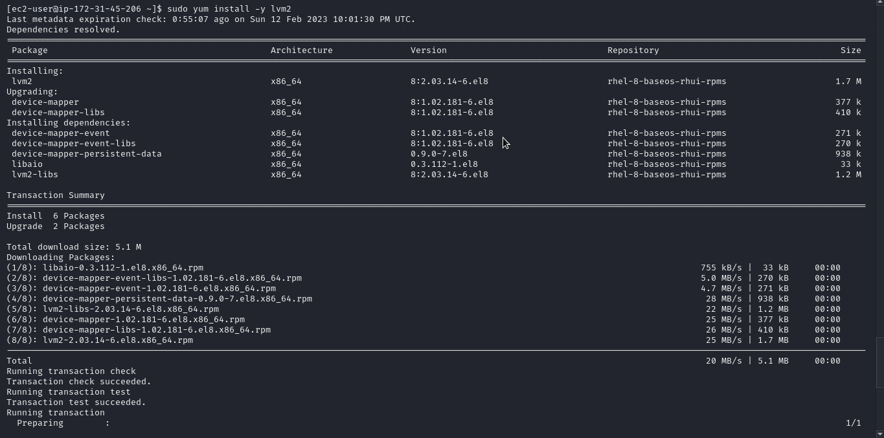

  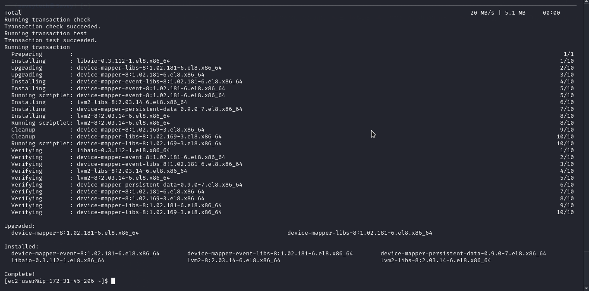

* Type `sudo lvmdiskscan` command to check for available partitions.

 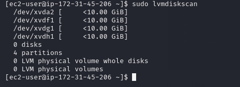
 * Use `pvcreate` utility to mark each of 3 disks as physical volumes (PVs) to be used by LVM
 
    `sudo pvcreate /dev/xvdf1`

    `sudo pvcreate /dev/xvdg1`

    `sudo pvcreate /dev/xvdh1`

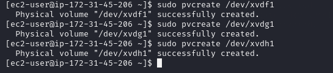

* Verify that your Physical volume has been created successfully by running `sudo pvs`

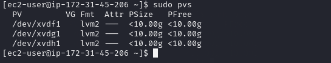

* Use `vgcreate` utility to add all 3 PVs to a volume group (VG). Name the VG webdata-vg. Type

`sudo vgcreate webdata-vg /dev/xvdh1 /dev/xvdg1 /dev/xvdf1`

* Verify that your VG has been created successfully by running `sudo vgs`

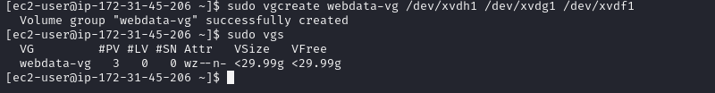

* Use `lvcreate` utility to create 2 logical volumes. Name one apps-lv and use half of the PV size. Name the second one logs-lv and use the remaining space of the PV size. NOTE: apps-lv will be used to store data for the Website while, logs-lv will be used to store data for logs.

    `sudo lvcreate -n apps-lv -L 9.9G webdata-vg`

    `sudo lvcreate -n logs-lv -L 9.9G webdata-vg`

    `sudo lvcreate -n opt-lv -L 9.9G webdata-vg`

   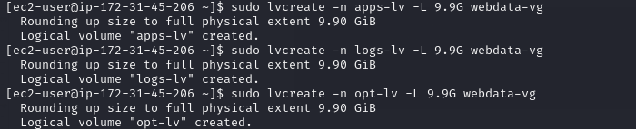

* Verify that your Logical Volume has been created successfully by typing `sudo lvs`

   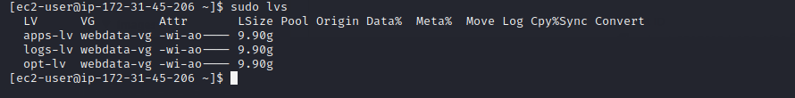

* Verify the entire setup by typing the following commands

    `sudo vgdisplay -v #view complete setup - VG, PV, and LV`

   `sudo lsblk`

   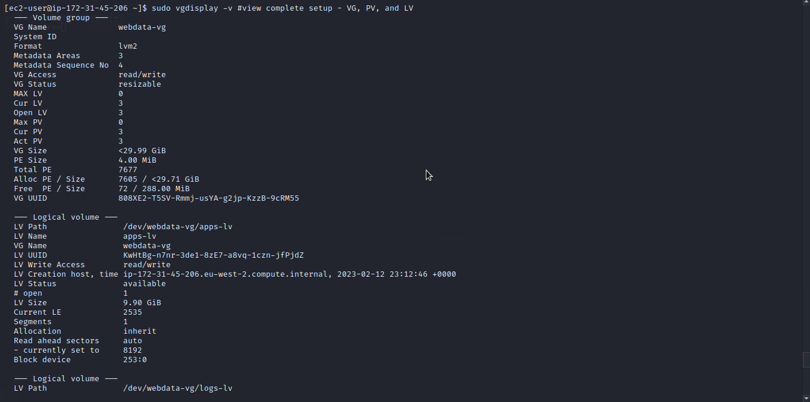

   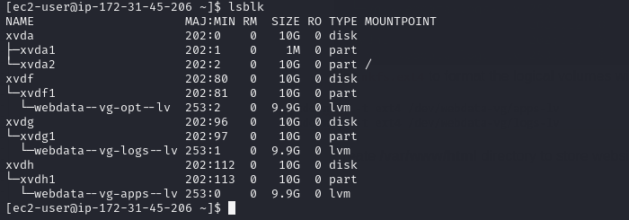

* Use `mkfs.xfs` to format the logical volumes with ext4 filesystem

    `sudo mkfs -t xfs /dev/webdata-vg/apps-lv`

    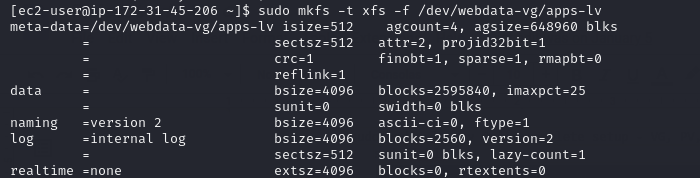

    `sudo mkfs -t xfs /dev/webdata-vg/logs-lv`

    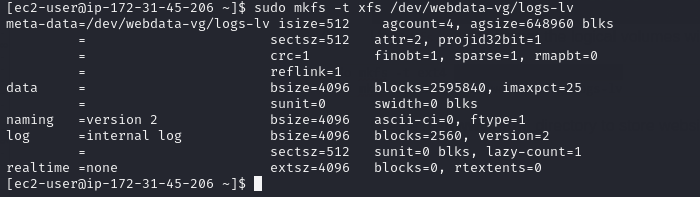

    `sudo mkfs -t xfs -f /dev/webdata-vg/opt-lv`

    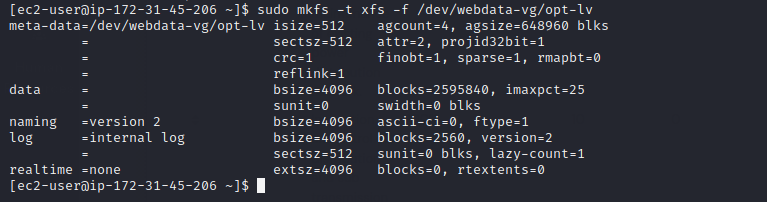

* Type `lsblk -f` to view partitions including the file system.
 
    

 * Create /mnt/apps directory to store website files

    `sudo mkdir -p /mnt/apps`

* Create /mnt/logs to store backup of log data
 
    `sudo mkdir -p /mnt/logs`

* Create /mnt/opt to be used by jenkins server in the next project.
 
    `sudo mkdir -p /mnt/opt`

* Mount lv-apps on /mnt/apps – To be used by webservers.

   `sudo mount /dev/webdata-vg/apps-lv /mnt/apps`
 
   * Use `rsync` utility to back up all the files in the log directory /var/log into /mnt/logs (This is required before mounting the file system). Type

     `sudo rsync -av /var/log/. /mnt/logs/`

     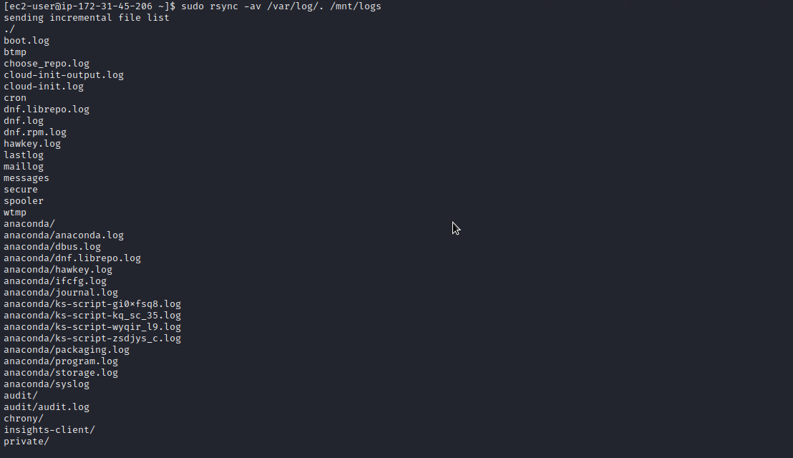

* Mount /var/log on logs-lv logical volume. – To be used by webserver logs.  (Note that all the existing data on /var/log will be deleted. This is why the last step above is very
important)

   `sudo mount /dev/webdata-vg/logs-lv /mnt/logs`

   * Restore log files back into /var/log directory

   `sudo rsync -av /mnt/logs. /var/log`

   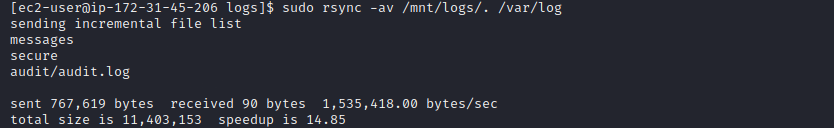

* Mount lv-opt on /mnt/opt – To be used by Jenkins server in one of our projects.
  
    `sudo mount /dev/webdata-vg/opt-lv /mnt/opt`

  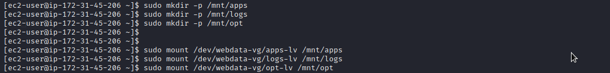

